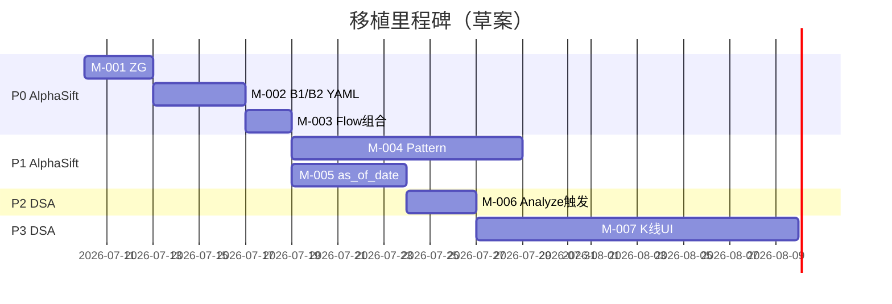

# self-stock-project → AlphaSift / DSA 移植改造方案

> **文档状态**：**M-001 ~ M-004 已在 AlphaSift 实施**（2026-07-06）  
> **适用范围**：`/Users/kongwei/stock/self-stock-project` 能力向 `/Users/kongwei/stock/alphasift` 与 `/Users/kongwei/stock/daily_stock_analysis` 的可选移植  
> **维护说明**：本文是 Agent 与维护者可继续执行的**设计/任务真源**。方案已于 2026-07-06 确认 scope；**在单独发起实施任务前不得开工写代码**。实施时按 §4 迁移项与 §10 PR 顺序推进。

---

## 1. 背景与目标

### 1.1 三个仓库的定位

| 仓库 | 路径 | 定位 | 与本方案关系 |
|------|------|------|-------------|
| **self-stock-project** | `/Users/kongwei/stock/self-stock-project` | A 股本地研究工具箱：Tushare → 本地 CSV → 指标/条件/形态 → 扫描/复盘；**无 LLM、无推送、无交易** | **能力来源** |
| **AlphaSift** | `/Users/kongwei/stock/alphasift` | A 股全市场发现/排序引擎：L1 硬过滤+因子 → L2 LLM 重排 → L3 后分析 | **选股逻辑移植目标** |
| **daily_stock_analysis (DSA)** | `/Users/kongwei/stock/daily_stock_analysis` | 多市场智能分析 + 通知 + Agent + Web/桌面；选股通过 `alphasift.dsa_adapter` 接入 | **展示/编排/深度分析移植目标** |

### 1.2 核心原则（必须遵守）

1. **选股逻辑不进 DSA 主仓库**  
   DSA 已通过 `docs/alphasift-integration.md` 明确：策略列表、全市场快照、初筛、因子评分、LLM 重排由 AlphaSift 负责；DSA 只负责开关、API 壳、provider 桥接、展示与错误提示。

2. **self-stock 的 CSV 数据层不整包迁移**  
   self-stock 使用 `stock_data_store` Submodule + 按股 CSV；AlphaSift 使用 parquet `daily-bars` / `flow-bars` + 多源 fallback；DSA 使用 SQLite + 实时拉取。三者架构不同，只迁移**算法语义**，不迁移存储形态。

3. **优先 YAML 策略 + daily/flow enrichment，而非复制 condition engine**  
   AlphaSift 已有 `HardFilterConfig` + `daily.py` + `flow.py` 扩展点；self-stock 的 15 条件 + 11 策略应**映射**为 AlphaSift 特征列与策略 YAML，而不是在 AlphaSift 内再建一套平行 condition 框架（除非 P1 形态模块确实需要）。

4. **向后兼容 `alphasift.dsa_adapter` 契约**  
   现有 DSA 依赖 `get_status()` / `list_strategies()` / `screen()`；新增能力优先通过：
   - 新策略 YAML（零 adapter 变更）
   - `Pick` / `candidates[]` **追加字段**（DSA 前端可选展示）
   - 新 CLI 子命令（pattern）  
   只有在 pattern 选股需要 Web 入口时，才扩展 adapter 与 DSA API。

5. **审查后再实施**  
   本文每条迁移项均含「验收标准」「风险」「建议 PR 边界」；实施前需 maintainer 确认优先级与是否纳入 scope。

6. **明确排除的能力不纳入本方案**  
   以下 self-stock 能力**不在移植范围内**（见 §11）；Agent 不得为实现其他迁移项而顺带引入这些能力。

### 1.3 相关文档索引

| 文档 | 路径 | 用途 |
|------|------|------|
| AlphaSift 集成说明 | `docs/alphasift-integration.md` | DSA ↔ AlphaSift 契约、配置、回滚 |
| self-stock 相似度算法 | `/Users/kongwei/stock/self-stock-project/docs/similarity_algorithms.md` | 形态匹配算法说明 |
| self-stock 资金流设计 | `/Users/kongwei/stock/self-stock-project/docs/2026-07-02-main-force-capital-flow-design.md` | flow 条件语义 |
| AlphaSift 策略指南 | `/Users/kongwei/stock/alphasift/docs/strategy-guide.md` | 目标策略 YAML 写法 |
| AlphaSift 结果 schema | `/Users/kongwei/stock/alphasift/docs/result-schema.md` | Pick / ScreenResult 字段 |

---

## 2. 能力对照总表

图例：**已有** = 目标仓库已具备同类能力；**部分** = 有近似实现但语义/规则不同；**无** = 缺失；**不移植** = 维持现状、继续留在 self-stock 或依赖现有替代。

### 2.1 选股 / 信号

| 能力 | self-stock | AlphaSift | DSA | 结论 |
|------|-----------|-----------|-----|------|
| B1/B2/ZG/brick 策略族 | 有（11 预设） | 无 ZG/brick/B1/B2 | 无（走 AlphaSift） | **移植 → AlphaSift** |
| 15 可组合技术条件 | 有 | 部分（MACD/RSI/MA/20d 等） | 无 | **移植 → AlphaSift** daily 特征 + YAML |
| 7 种形态相似度（含 DTW） | 有 | 无 | 无 | **移植 → AlphaSift** 新模块 |
| 两阶段 tech+flow 扫描 | 有 | 部分（`main_inflow_momentum`） | 透传 | **移植 → AlphaSift** 组合策略 YAML |
| 缩量筛选（放量后缩量回调） | 有（细规则） | 部分（`shrink_pullback`） | 透传 | **不移植**；沿用 AlphaSift 现有 `shrink_pullback` |
| `as_of_date` 历史时点扫描 | 有 | 无明确 API | 无 | **移植 → AlphaSift** |
| 多策略批跑 + enrich | 有 | 有单次 `screen` + `evaluate` | 单次 screen API | **不移植**；按需多次调用 `screen` / `--save-run` |
| 个股阶段分类（建仓/洗盘/拉升/出货） | 有 | 无 | 有 `market_phase`（大盘，非个股） | **不移植** |
| 行业龙头 + 概念富化 | 有 | 部分（industry/hotspot） | 热点 UI | **不移植**；AlphaSift/DSA 现有 industry/hotspot 能力保留，self-stock enrich 流程保留 |
| LLM 重排 | 无 | 有 | 桥接 | 保留 AlphaSift |
| 热点题材发现 | 无 | 有 | EastMoney 兜底 UI | 保留现有 |

### 2.2 数据层

| 能力 | self-stock | AlphaSift | DSA | 结论 |
|------|-----------|-----------|-----|------|
| 本地 CSV + QFQ 漂移检测 | 有 | parquet + 多源 | SQLite + 多源 | **不移植** |
| 资金流横向按日更新 | 有 | `flow-bars sync` | — | 已覆盖 |
| 基本面 PIT（时点无偏差） | 缺口 | 潜在前视 | 有 fundamental adapter | 两边独立改进，不在本方案 scope |

### 2.3 研究 / 复盘 / 交付

| 能力 | self-stock | AlphaSift | DSA | 结论 |
|------|-----------|-----------|-----|------|
| 5/10/20 日 follow-up | 有 | `evaluate_saved_run`（T+N） | backtest 引擎 | **不移植**；self-stock follow-up 或 AlphaSift/DSA 现有 evaluate/backtest 各自使用 |
| Research brief JSON | 有 | scorecard（部分） | Agent 可生成 | **不移植** |
| Excel 多 sheet 导出 | 有 | 无 | 无 | **不移植**；self-stock `export_multi_strategy_workbook.mjs` 保留 |
| Web K 线 + 形态框选 | 有（Lightweight Charts） | 无 UI | Recharts（非专业 K 线） | **可选 → DSA 新路由** |
| 10+ 通知渠道 | 无 | 无 | 有 | 保留 DSA |
| Agent 问股 / 多市场 | 无 | 无 | 有 | 保留 DSA |

---

## 3. 架构与职责边界

```text
┌─────────────────────────────────────────────────────────────────────────┐
│ self-stock-project（能力来源；排除项继续在本仓库使用）                      │
│  stock_indicator_engine │ stock_flow_engine │ stock_selector │ web_app   │
└───────────────────────────────┬─────────────────────────────────────────┘
                                │ 算法/语义移植（非 CSV 层整包）
                                ▼
┌─────────────────────────────────────────────────────────────────────────┐
│ AlphaSift（选股上游 — 移植目标）                                          │
│  daily.py / flow.py / filter.py / strategies/*.yaml / pattern/（新增）   │
│  dsa_adapter.py（按需扩展）                                              │
└───────────────────────────────┬─────────────────────────────────────────┘
                                │ alphasift.dsa_adapter.screen()
                                ▼
┌─────────────────────────────────────────────────────────────────────────┐
│ daily_stock_analysis（交付层 — 只接结果，不写选股逻辑）                   │
│  src/services/alphasift_service.py │ api/v1/endpoints/alphasift.py       │
│  apps/dsa-web/StockScreeningPage.tsx │ 分析触发 / 可选 K 线 UI          │
└─────────────────────────────────────────────────────────────────────────┘
```

**禁止事项**：

- 在 `daily_stock_analysis/src/` 或 `data_provider/` 内实现 B1/形态扫描主逻辑
- 在 DSA 内复制 self-stock 的 `stock_data_store` CSV 读写
- 未扩展 adapter 契约前，在 DSA 前端硬编码 self-stock 专有字段名（应走 AlphaSift `Pick` 标准字段）
- 以实现本方案其他项为由，引入 §11 所列排除能力

---

## 4. 迁移项详细规格

以下每项包含：**源文件**、**目标位置**、**实现步骤**、**契约变更**、**测试**、**验收标准**、**风险**、**建议 PR 粒度**。

---

### M-001：ZG 趋势线指标（P0）

#### 语义

通达信风格 ZG 指标：

- **ZG 短期**：`EMA(EMA(C,10),10)`
- **ZG 长期**：`(MA14 + MA28 + MA57 + MA114) / 4`

#### 源文件

| 文件 | 说明 |
|------|------|
| `/Users/kongwei/stock/self-stock-project/stock_indicator_engine/indicators/zg.py` | `compute_zg_short`, `compute_zg_long`, `add_zg_trend_features` |
| `/Users/kongwei/stock/self-stock-project/stock_indicator_engine/signals/conditions.py` | `CONDITION_ZG_SHORT_ABOVE_LONG`, `CONDITION_CLOSE_ABOVE_ZG_LONG` |

#### 目标位置（AlphaSift）

| 文件 | 变更 |
|------|------|
| `alphasift/alphasift/daily_indicators.py`（新建）或 `daily.py` 内私有函数 | 移植 ZG 计算，输入 `close` Series，输出 `zg_short`, `zg_long` |
| `alphasift/alphasift/daily.py` | 在 `_DAILY_FEATURE_DEFAULTS` 增加列；enrich 时写入 |
| `alphasift/alphasift/models.py` `Pick` | 可选追加 `zg_short`, `zg_long`, `close_above_zg_long`, `zg_short_above_long` |
| `alphasift/alphasift/filter.py` | 扩展 `HardFilterConfig` + `apply_hard_filters` |

#### 建议新增 HardFilter 字段

```python
# models.HardFilterConfig 追加（命名与 daily 列一致）
require_zg_short_above_long: bool = False
require_close_above_zg_long: bool = False
kdj_j_max: float | None = None          # 对应 kdj_j_below
kdj_j_min: float | None = None          # 对应 kdj_j_above
prev_kdj_j_max: float | None = None     # B2 用
daily_amplitude_max: float | None = None
daily_change_min: float | None = None
daily_change_max: float | None = None
require_volume_above_prev: bool = False
require_brick_turn_up: bool = False
```

#### 实现步骤

1. 从 `zg.py` 复制纯函数（无 I/O），补单元测试对比 self-stock 同输入输出。
2. 在 `daily.py` 的 K 线 enrich 路径中，当 `lookback_days >= 200` 时计算 ZG（不足则 flag `daily_quality_flags+=zg_insufficient_bars`）。
3. 扩展 `filter.py` 读取新列；缺失列时 raise `SnapshotFieldMissingError` 或按 AlphaSift 惯例在 daily 硬过滤阶段 reject。
4. 更新 `docs/strategy-guide.md` 与 `tests/test_pipeline_daily.py`。

#### 测试

- `tests/test_daily_indicators_zg.py`：固定 OHLCV fixture，对比 self-stock 参考向量
- `tests/test_filter_zg.py`：hard filter 边界

#### 验收标准

- `alphasift doctor data-sources` 不受影响
- 任意策略 YAML 可引用 `require_zg_short_above_long: true` 且 pipeline 可跑通
- `min_bars` 不足时 degrade 行为明确（warnings 非 silent pass）

#### 风险

- ZG 长期需 114+ 根 K 线；AlphaSift 默认 lookback 120 刚好够，需文档说明
- 与现有 `signal_score` 计算顺序：先算指标再算 composite score

#### 建议 PR

AlphaSift 单 PR：`feat: add ZG trend daily features and hard filters`

---

### M-002：KDJ / BOLL / brick 指标与 B1/B2 策略 YAML（P0）

#### 源文件

| 文件 | 说明 |
|------|------|
| `stock_indicator_engine/indicators/kdj.py` | KDJ 计算 |
| `stock_indicator_engine/indicators/boll.py` | BOLL |
| `stock_indicator_engine/indicators/brick.py` | 砖型图转向 |
| `stock_indicator_engine/strategies/presets.py` | B1/B2/B1_PERFECT 等策略定义 |
| `stock_indicator_engine/signals/conditions.py` | 全部 15 条件 |

#### 目标位置

| 文件 | 说明 |
|------|------|
| `alphasift/alphasift/daily_indicators.py` | kdj_k/d/j, boll_upper/lower, brick_turn_up |
| `alphasift/alphasift/strategies/b1.yaml` | 新建 |
| `alphasift/alphasift/strategies/b1_above_long.yaml` | 新建 |
| `alphasift/alphasift/strategies/b1_perfect.yaml` | 新建 |
| `alphasift/alphasift/strategies/b2.yaml` | 新建 |
| `alphasift/alphasift/strategies/brick_turn_up.yaml` | 新建 |

#### B1 策略 YAML 草案（与 self-stock 对齐）

```yaml
# alphasift/strategies/b1.yaml
name: b1
display_name: B1（常规）
description: KDJ.J<13 且 ZG 短期 > ZG 长期
version: "1.0"
category: reversal
tags: [b1, kdj, zg, daily_k]
screening:
  enabled: true
  market_scope: [cn]
  hard_filters:
    exclude_st: true
    amount_min: 50000000
    kdj_j_max: 13
    require_zg_short_above_long: true
  factor_weights:
    reversal: 0.35
    momentum: 0.25
    stability: 0.20
    liquidity: 0.20
  max_output: 20
```

`b1_perfect` 在 `b1` 基础上增加：

```yaml
    require_close_above_zg_long: true
    daily_amplitude_max: 4.2
    daily_change_min: -2.0
    daily_change_max: 2.5
```

`b2` 增加：

```yaml
    prev_kdj_j_max: 13
    daily_change_min: 3.95
    require_volume_above_prev: true
    kdj_j_max: 80
    require_zg_short_above_long: true
    require_close_above_zg_long: true
```

#### 条件 → HardFilter 映射表

| self-stock condition id | AlphaSift hard_filter 字段 | 依赖 daily 列 |
|-------------------------|---------------------------|---------------|
| `kdj_j_below` | `kdj_j_max` | `kdj_j` |
| `kdj_j_above` | `kdj_j_min` | `kdj_j` |
| `kdj_golden_cross` | `require_kdj_golden_cross: true` | `kdj_k`, `kdj_d` + prev |
| `zg_short_above_long` | `require_zg_short_above_long` | `zg_short`, `zg_long` |
| `close_above_zg_long` | `require_close_above_zg_long` | `close`, `zg_long` |
| `macd_golden_cross` | 已有 `macd_status_whitelist` | `macd_status` |
| `macd_dif_above_zero` | `macd_status_whitelist: [above_zero]` | `macd_status` |
| `close_below_boll_lower` | `require_close_below_boll_lower` | `close`, `boll_lower` |
| `close_above_boll_upper` | `require_close_above_boll_upper` | `close`, `boll_upper` |
| `daily_amplitude_below` | `daily_amplitude_max` | 当日振幅 % |
| `daily_change_in_range` | `daily_change_min/max` | `change_pct` 或 daily 计算 |
| `daily_change_above` | `daily_change_min` | 同上 |
| `volume_above_prev` | `require_volume_above_prev` | `volume`, `prev_volume` |
| `prev_kdj_j_below` | `prev_kdj_j_max` | `prev_kdj_j` |
| `brick_turn_up` | `require_brick_turn_up` | `brick_turn_up` |

#### 实现步骤

1. 完成 M-001 ZG + KDJ/BOLL/brick 指标函数
2. 扩展 `HardFilterConfig` 与 `filter.py`（含 `_DAILY_FILTER_DEFAULTS`）
3. 添加 5 个策略 YAML；`strategy.py` 自动发现
4. `tests/test_strategies_b1_b2.py`：用 self-stock 导出的 fixture JSON（建议从单次策略 scan 结果抽 3–5 只股票）做交叉验证

#### 验收标准

- `alphasift strategies` 列出 `b1`, `b1_above_long`, `b1_perfect`, `b2`, `brick_turn_up`
- DSA 设置页开启 AlphaSift 后 `/api/v1/alphasift/strategies` 可见新策略
- `alphasift screen b1 --no-llm` 可完成（允许结果为空但不应 crash）

#### 风险

- self-stock 用本地 CSV qfq；AlphaSift 多源 qfq 口径可能略有差异 → 接受小幅候选差异，测试用 tolerance
- B2 依赖「前一日」字段，enrich 需保留 prev bar 特征

#### 建议 PR

可与 M-001 合并，或拆为「指标」+「策略 YAML」两个 PR

---

### M-003：B1/B2 + 资金流组合策略（P0）

#### 源文件

| 文件 | 说明 |
|------|------|
| `stock_flow_engine/strategies/presets.py` | `b1_main_inflow_5d`, `b1_main_inflow_5d_no_divergence`, `b2_main_inflow_5d` |
| `stock_flow_engine/conditions.py` | flow 条件定义 |
| `web_app/services/combined_scan_service.py` | 两阶段扫描编排 |

#### AlphaSift 现状

- `alphasift/flow.py` 已有：`main_inflow_streak`, `main_net_inflow_5d`, `price_up_flow_out`
- `filter.py` 已有：`main_inflow_streak_min`, `main_net_inflow_5d_min`, `require_no_price_up_flow_out`
- 策略 `strategies/main_inflow_momentum.yaml` 存在（路径在 repo 根 `strategies/`）

#### 目标

新增 YAML（或扩展现有）：

| 策略 id | 技术基底 | flow 条件 |
|---------|---------|-----------|
| `b1_main_inflow_5d` | `b1` hard_filters | `main_inflow_streak_min: 5` |
| `b1_main_inflow_5d_no_divergence` | 同上 | + `require_no_price_up_flow_out: true` |
| `b2_main_inflow_5d` | `b2` hard_filters | `main_net_inflow_5d_min: 0` |

#### 实现步骤

1. 复制 M-002 的 b1/b2 hard_filters 块到组合策略 YAML
2. 确保 `screen_prerequisites.py` 标记需要 `flow-bars`
3. 文档：`alphasift flow-bars sync` 前置条件

#### 验收标准

- 无 flow 数据时：`doctor` / readiness 明确 warning，不 silent 空结果
- 有 flow 数据时：组合策略候选 ⊆ 纯技术策略候选（flow 为附加过滤）

#### 建议 PR

AlphaSift 单 PR，仅 YAML + readiness 测试

---

### M-004：形态相似度选股模块（P1）

#### 源文件树

```text
self-stock-project/stock_selector/
├── similarity/metrics.py          # 7 种度量
├── similarity/similarity_engine.py
├── retrieval/retrieval_engine.py  # 全市场窗口检索
├── features/feature_pipeline.py
├── selection/selection_engine.py
└── config.py
```

#### 目标模块（AlphaSift 新建）

```text
alphasift/alphasift/pattern/
├── __init__.py
├── config.py              # 默认 window_length, metrics, top_k
├── features.py            # 复用 daily_indicators 输出
├── metrics.py             # 从 self-stock 移植（纯 numpy）
├── search.py              # search_pattern(query_bars, universe, ...)
└── cli.py                 # pattern-search 子命令入口
```

#### 支持度量（与 self-stock 一致）

| id | 类别 |
|----|------|
| `euclidean`, `manhattan`, `chebyshev` | 重采样距离 |
| `dtw` | 动态时间规整 |
| `pearson`, `spearman` | 相关 |
| `cosine` | 夹角 |

#### API 设计选项

**选项 1 — 仅 CLI（低成本）**

```bash
alphasift pattern-search --query-json query.json --metric dtw --top 30
```

**选项 2 — 扩展 dsa_adapter（供 DSA Web）**

```python
# alphasift/dsa_adapter.py — 契约 version 升级为 "2" 时追加
def pattern_search(query_bars: list[dict], *, metric: str = "dtw", max_results: int = 30, context: dict | None = None) -> dict: ...
```

DSA 侧：

- `api/v1/endpoints/alphasift.py` — `POST /pattern-search`（可选）
- 新页面 `/pattern` 或嵌入 `/screening` 第二个 Tab

#### 性能注意

self-stock 全市场逐股 Python 循环是已知瓶颈；AlphaSift 侧建议：

1. 先用 `daily-bars` local store 限定 universe
2. 粗筛：波动率/成交额 pre-filter
3. 并行 `ThreadPoolExecutor`（与 `daily.py` 一致）
4. 后续向量化（roadmap 另项）

#### 验收标准

- `tests/test_pattern_metrics.py` 与 self-stock 同 fixture 相似度误差 < 1e-6
- 100 股样本 search < 30s（本地 parquet）

#### 建议 PR

AlphaSift 分 3 PR：metrics → search → CLI/API

---

### M-005：`as_of_date` 历史时点扫描（P1）

#### 源文件

- `web_app/services/condition_service.py` — 扫描参数 `as_of_date`
- self-stock 全链路支持 point-in-time

#### AlphaSift 改动点

| 组件 | 变更 |
|------|------|
| `pipeline.screen()` | 新参数 `as_of_date: str | None = None` |
| `daily.py` `enrich_daily_features` | 已有 `end_date`，需贯通 pipeline |
| `flow.py` | `end_date` 截断 moneyflow |
| `snapshot.py` | **难点**：历史快照无统一源 → 文档声明「仅 daily/flow 时点，快照仍用 current」或接入 Tushare `daily_basic(trade_date=)` |
| `store.py` | 保存 run 时记录 `as_of_date` |
| `dsa_adapter.screen()` | 透传 `context["as_of_date"]` |

#### 分阶段交付

- **Phase A**：daily/flow 特征按 `as_of_date` 截断（研究 replay 够用）
- **Phase B**：历史 snapshot 源（Tushare/local cache）— 需单独设计

#### 验收标准

- 同一 `as_of_date`，两次 screen 结果 deterministic
- 不扩展 AlphaSift evaluate 或 DSA follow-up 展示（见 §11 排除项）

---

### M-006：screen → DSA 深度分析触发（P2）

#### 说明

触发 DSA **现有**分析流水线（`POST /api/v1/analysis/tasks`），**不**移植 self-stock 的 `run_research_brief.py` JSON 格式。

#### 目标工作流

```text
AlphaSift screen (top N)
  → DSA POST /api/v1/analysis/tasks { stocks: [...] }
  → 可选 NotificationService 推送
  → 可选 DecisionSignal 写入
```

#### DSA 实现点

| 文件 | 变更 |
|------|------|
| `apps/dsa-web/src/pages/StockScreeningPage.tsx` | 「分析选中候选」按钮 |
| `src/services/alphasift_service.py` | `enqueue_analysis_for_candidates(candidates, max_n=3)` |
| `docs/alphasift-integration.md` | 追加编排说明 |

#### 约束

- 默认 `max_n=3` 控制 LLM 成本
- 需 `ALPHASIFT_ENABLED=true` 且用户已登录（若 auth 开启）
- 输出沿用 DSA 标准报告 schema，不新增 Research brief 字段

---

### M-007：K 线研究 Web UI（P3，可选）

#### 源文件

- `self-stock-project/web_app/static/` — Lightweight Charts 5.1

#### 目标

DSA 新路由 `/research` 或 `/screening?tab=chart`：

- 后端：复用 DSA `data_provider` + AlphaSift daily-bars
- 前端：引入 `lightweight-charts`，指标 overlay 调 API

#### 工作量评估

- 大（2–4 周），与 self-stock Web 功能重叠
- **短期建议**：继续并行使用 self-stock Web；DSA 仅做候选列表跳转外链（可选）

---

## 5. DSA 侧改动清单（汇总）

DSA **不应**复制选股算法；仅以下 touch points：

| 文件 | 可能变更 | 依赖迁移项 |
|------|---------|-----------|
| `src/services/alphasift_service.py` | 透传 `as_of_date` | M-005 |
| `api/v1/endpoints/alphasift.py` | 新 endpoint（pattern，若 M-004 选项 2） | M-004 |
| `apps/dsa-web/src/pages/StockScreeningPage.tsx` | 分析触发按钮 | M-006 |
| `docs/alphasift-integration.md` | 契约版本、新字段说明 | 各 AlphaSift 项 |
| `requirements.txt` / `src/config.py` | AlphaSift pin bump | AlphaSift 发版后 |

**DSA adapter 候选字段扩展（向后兼容追加）**：

```typescript
// apps/dsa-web/src/api/alphasift.ts — optional fields
interface AlphaSiftCandidate {
  // existing...
  zgShortAboveLong?: boolean;
}
```

---

## 6. 优先级与里程碑

### Phase P0（建议 1–2 周，AlphaSift 为主）

| ID | 项 | 仓库 |
|----|-----|------|
| M-001 | ZG 指标 | AlphaSift |
| M-002 | KDJ/BOLL/brick + B1/B2 YAML | AlphaSift |
| M-003 | B1/B2 + flow 组合 | AlphaSift |

**P0 完成标志**：DSA 选股页可选 `b1` / `b2` / `b1_main_inflow_5d` 等策略；`alphasift screen b1 --no-llm` 稳定可跑。

### Phase P1（2–4 周）

| ID | 项 |
|----|-----|
| M-004 | pattern 模块 |
| M-005 | as_of_date |

### Phase P2（DSA 集成）

| ID | 项 |
|----|-----|
| M-006 | screen → analyze 触发 |

### Phase P3（可选）

| ID | 项 |
|----|-----|
| M-007 | K 线 Web UI |



---

## 7. 验证矩阵

### 7.1 AlphaSift

```bash
cd /Users/kongwei/stock/alphasift
pip install -e ".[daily-store]"
pytest -m "not network"
alphasift doctor data-sources --all-strategies
alphasift screen b1 --no-llm --max-output 5
```

### 7.2 DSA（AlphaSift 集成）

```bash
cd /Users/kongwei/stock/daily_stock_analysis
./scripts/ci_gate.sh
python -m pytest tests/test_alphasift_api.py -m "not network"
# Web
cd apps/dsa-web && npm ci && npm run lint && npm run build
```

### 7.3 交叉验证（self-stock vs AlphaSift）

建议维护 `tests/fixtures/self_stock_cross/`：

| fixture | 来源 |
|---------|------|
| `b1_scan_<date>.json` | self-stock 单次 B1 策略 scan 输出 |
| `b2_scan_<date>.json` | self-stock 单次 B2 策略 scan 输出 |
| `daily_<ts_code>.csv` | 3–5 只代表股 qfq 日线 |

脚本 `scripts/compare_self_stock_alphasift.py`（可选）：对比同日同策略候选 Jaccard 相似度。

---

## 8. 风险登记

| 风险 | 影响 | 缓解 |
|------|------|------|
| qfq 口径不一致 | 候选差异 | 交叉验证 tolerance；文档说明 |
| flow-bars 未 sync | 组合策略空结果 | readiness + doctor 前置检查 |
| pattern 全市场性能 | 超时 | local store + 粗筛 + 异步 task |
| adapter 契约漂移 | DSA 424 | 追加字段 only；契约 version bump 需同步 DSA pin |
| 审查前过早实施 | 返工 | 本文 status=草案；PR 需引用审查结论 |
| 误引入排除能力 | scope 膨胀 | PR review 对照 §11 |

---

## 9. 回滚方案

| 层级 | 操作 |
|------|------|
| DSA 业务 | `ALPHASIFT_ENABLED=false` 并重启 |
| DSA 适配层版本 | 回退 `requirements.txt` pin（见 `docs/alphasift-integration.md` 路径 B） |
| AlphaSift 单策略 | 策略 YAML `screening.enabled: false` 或删除文件 |
| AlphaSift 代码 | git revert 对应 PR；DSA pin 指向上一个 commit |

---

## 10. Agent 继续工作清单

审查通过后，Agent 执行任一迁移项前应：

1. **读本文对应 M-xxx 节 + 源文件**（路径见 §4）
2. **确认 §11 排除项未被引入**
3. **确认目标仓库分支**：
   - AlphaSift 改动在 `/Users/kongwei/stock/alphasift`
   - DSA 改动在 `/Users/kongwei/stock/daily_stock_analysis`
4. **不得**在 DSA 内实现 screening 核心逻辑
5. **运行 §7 验证矩阵** 中对应命令
6. **更新文档**：
   - AlphaSift：`docs/strategy-guide.md`, `docs/result-schema.md`
   - DSA：`docs/alphasift-integration.md`, `docs/CHANGELOG.md` `[Unreleased]`
7. **PR 描述需包含**：改了什么、为什么这么改、验证情况、未验证项、风险、回滚方式（符合 `AGENTS.md` §9）
8. **DSA 合入 AlphaSift 新能力时**：同步 bump `requirements.txt` + `src/config.py` `DEFAULT_ALPHASIFT_INSTALL_SPEC` + `.env.example`

### 10.1 推荐 PR 顺序（审查后）

1. AlphaSift: M-001 + M-002（指标 + B1/B2 策略）
2. AlphaSift: M-003（flow 组合）
3. AlphaSift: M-005（as_of_date）
4. AlphaSift: M-004（pattern，可独立）
5. DSA: pin bump + M-006（分析触发）
6. 可选: M-007（K 线 UI）

---

## 11. 明确不移植项

以下能力**不在本方案 scope 内**。若仍需使用，继续依赖 self-stock-project 或 AlphaSift/DSA 现有替代能力。

| 项 | 原因 | 替代 / 说明 |
|----|------|------------|
| **缩量筛选（放量后缩量回调）** | 审查决定不移植 self-stock 细规则 | AlphaSift 已有 `shrink_pullback` 策略；self-stock `VolumeContractionRule` 仍可在原项目使用 |
| **个股阶段分类（建仓/洗盘/拉升/出货）** | 审查决定不移植 | DSA 仅有大盘 `market_phase`；个股阶段继续在 self-stock enrich 流程中使用 |
| **多策略批跑 + enrich** | 审查决定不移植 | 多次调用 `alphasift screen` + `--save-run`；self-stock `run_multi_strategy_scan.py` / `enrich_multi_strategy_results.py` 保留 |
| **本地 CSV + QFQ 漂移检测** | 审查决定不移植 | AlphaSift `daily-bars sync` + 多源 fallback；self-stock `stock_data_store` 继续独立维护 |
| **Research brief JSON** | 审查决定不移植 | DSA Agent / 标准分析报告已覆盖深度研究；不新增 self-stock brief schema |
| **5/10/20 日 follow-up** | 审查决定不移植 self-stock follow-up 语义与 DSA 展示 | self-stock `run_selection_followup.py` 保留；AlphaSift 现有 `alphasift evaluate`、DSA `backtest` 各自独立使用，本方案不改造 |
| **Excel 多 sheet 导出** | 审查决定不移植 | self-stock `export_multi_strategy_workbook.mjs` 保留；DSA 选股页不新增 Excel 导出 |
| **行业龙头 + 概念富化** | 审查决定不移植 | self-stock `assess_industry_leader` + Tushare `concept_detail` enrich 保留；AlphaSift `industry`/`hotspot`、DSA 热点 UI 各自独立使用，本方案不移植 self-stock 启发式龙头规则 |
| `stock_data_store` 整体 CSV 架构 | 与 AlphaSift parquet / DSA SQLite 冲突 | — |
| self-stock Web App 全栈 | 工作量大；短期并行使用 | self-stock Web 或可选 M-007 |
| self-stock Agent CLI skill 层 | DSA 已有 Agent + Bot | — |
| self-stock 通知/调度 | DSA 已覆盖 | — |
| 回测引擎 | self-stock 无；DSA 已有 `backtest_engine` | — |
| 整包复制 `condition_service` 扫描循环 | 应映射为 AlphaSift pipeline | — |

---

## 12. 审查决策记录（人工填写）

| 日期 | 决策人 | 批准项 | 推迟/拒绝项 | 备注 |
|------|--------|--------|-------------|------|
| 2026-07-06 | 用户 | M-001 ~ M-007（§11 排除项除外） | 见 §11 共 8 项用户明确排除能力 | **方案确认；暂不实施** |
| 2026-07-05 | — | 初稿范围收敛 | 缩量/阶段/批跑/QFQ/Research brief/follow-up/Excel/龙头概念 | 已并入 §11 |
